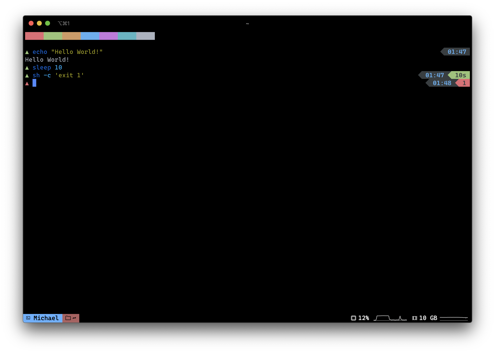

# spartan.fish

A colorful Fish shell prompt with zero features. Pairs very well with iTerm2 status bar.



**Note:**

For this shell prompt to be practical, many common features have been replaced by
the [iTerm2 Status Bar](https://www.iterm2.com/documentation-status-bar.html). It gives it quite
a unique look without sacrificing (as) many features.

**Features replaced by Status Bar:**
- Current directory.
- Username.
- Git support.

**Features:**
- Prompt title based on the great [pure](https://github.com/rafaelrinaldi/pure) theme.
- Clock.
- Timer.
- Error codes.
- Fish 'private' mode indicator.

## Install

**With [Fisher](https://github.com/jorgebucaran/fisher):**
```sh
fisher add mbullington/spartan
```

If not using Fisher, you'll also need to make sure `fishpkg/fish-humanize-duration`
and `oh-my-fish/plugin-technicolor` are included. Fisher will take care of this automatically.

## License

With the exception of `fish_title.fish`, the following
 license applies:

```
Anyone is free to copy, modify, publish, use, compile,
sell, or distribute this software, either in source
code form or as a compiled binary, for any purpose,
commercial or non-commercial, and by any means.

In jurisdictions that recognize copyright laws, the 
author or authors of this software dedicate any and 
all copyright interest in the software to the public 
domain. We make this dedication for the benefit of the 
public at large and to the detriment of our heirs and 
successors. We intend this dedication to be an overt 
act of relinquishment in perpetuity of all present and 
future rights to this software under copyright law.

THE SOFTWARE IS PROVIDED "AS IS", WITHOUT WARRANTY OF 
ANY KIND, EXPRESS OR IMPLIED, INCLUDING BUT NOT 
LIMITED TO THE WARRANTIES OF MERCHANTABILITY, FITNESS
FOR A PARTICULAR PURPOSE AND NONINFRINGEMENT. IN NO 
EVENT SHALL THE AUTHORS BE LIABLE FOR ANY CLAIM, 
DAMAGES OR OTHER LIABILITY, WHETHER IN AN ACTION OF
CONTRACT, TORT OR OTHERWISE, ARISING FROM, OUT OF OR 
IN CONNECTION WITH THE SOFTWARE OR THE USE OR OTHER 
DEALINGS IN THE SOFTWARE.
```

`fish_title.fish` is under the following license:

```
The MIT License (MIT)

Copyright (c) Rafael Rinaldi <rafael@rinaldi.io> (rinaldi.io)

Permission is hereby granted, free of charge, to any person obtaining a copy
of this software and associated documentation files (the "Software"), to deal
in the Software without restriction, including without limitation the rights
to use, copy, modify, merge, publish, distribute, sublicense, and/or sell
copies of the Software, and to permit persons to whom the Software is
furnished to do so, subject to the following conditions:

The above copyright notice and this permission notice shall be included in
all copies or substantial portions of the Software.

THE SOFTWARE IS PROVIDED "AS IS", WITHOUT WARRANTY OF ANY KIND, EXPRESS OR
IMPLIED, INCLUDING BUT NOT LIMITED TO THE WARRANTIES OF MERCHANTABILITY,
FITNESS FOR A PARTICULAR PURPOSE AND NONINFRINGEMENT. IN NO EVENT SHALL THE
AUTHORS OR COPYRIGHT HOLDERS BE LIABLE FOR ANY CLAIM, DAMAGES OR OTHER
LIABILITY, WHETHER IN AN ACTION OF CONTRACT, TORT OR OTHERWISE, ARISING FROM,
OUT OF OR IN CONNECTION WITH THE SOFTWARE OR THE USE OR OTHER DEALINGS IN
THE SOFTWARE.
```


